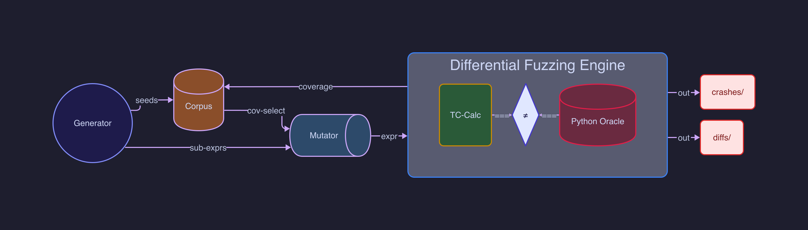

# What do I know about my PUT? 

## TC-Calc

`terminal-clicks` built in arithmetic expression evaluator.

- ~350 LOC C
- Recursive descent with precedence climbing — no heap, no allocations.
- Two globals (`calc_token`, `expression`) reset per call.

<!-- jump_to_middle -->
```c
double calc_eval(const char *expression);
```

---

# Supported Formats

| Format | Example | Notes |
|--------|---------|-------|
| Decimal | `42`, `999` | Plain integers |
| Float | `3.14`, `.5` | Leading-dot supported |
| Hex | `0xFF`, `0XFF` | Upper `0X` breaks Python |
| Binary | `0b10`, `0B10` | Upper `0B` breaks Python |
| Bare zero | `0` | Returns NAN (parser bug) |

---

# Crafting the Fuzzer

## Grammar-Aware

Inputs are generated from a typed AST, not random bytes.
Most byte-level mutations fail parsing — grammar-awareness avoids that waste.

```rust
enum Expr {
    Num(NumLit),          // literal
    UnaryNeg(Box<Expr>),  // -expr
    BinOp { left: Box<Expr>, op: Op, right: Box<Expr> },
    Paren(Box<Expr>),     // (expr)
}

enum Op { Add, Sub, Mul, Div, Mod, Power,
          BitOr, BitXor, BitAnd, Shl, Shr }
```

## Generation Weights (max depth 5)

```
35%  numeric literal     35%  binary op     13%  unary neg
12%  parenthesized        5%  dangerous pattern (26 hardcoded)
```

---

## Two-Stage Mutation

```
Stage 1 — ExprMutator (grammar-aware, one per input):
  compose 60%   "1+2" → "0xFF**3+1+2"
  parens  20%   "1+2" → "(1+2)"
  negate  20%   "1+2" → "-1+2"

Stage 2 — HavocScheduledMutator (byte-level, 1-4 stacked):
  bit flips, byte insert/delete, crossover
  "(1+2)" → "(1+2"    "0xFF" → "0xFG"    "<<" → "<"
```

## Dangerous Patterns

```
n%0   n/0              div/mod by zero → SIGFPE (hardware trap)
n<<64  n>>64           shift >= 64 → UB
(-n)<<m                left shift of negative → UB
9999999999999999999|n  double → long long overflow → UB
-n**2                  precedence: (-n)**2 vs -(n**2)
(-n)%(-m)              C truncation vs Python floor
```

---

# Architecture



---

# Crash Analysis

<!-- jump_to_middle -->
The fuzzer produces thousands of raw crash/diff files, triaging by hand would suck.

---

# Use Claude
<!-- jump_to_middle -->


___
## Pipeline

```
crashes/ + diffs/
      │
      ▼
  prompt       ← pair each input with its crash type and oracle output
      │
      ▼
  Claude / Gemini  ← structured prompt per crash
      │
      ▼
  REPORT.md        ← 9 bug classes, root cause analysis, fix per bug
```

## Report

```
Input:    424%.477    Crash: SIGFPE    Python: 0.42400000000001814
```

LLM output (actual REPORT.md entry):

```
Bug 4: Integer Modulo/Division by Zero
Severity: High      Location: calc_term:158
Root cause: (int)t truncates 0.477 → 0, integer modulo by zero
            is a hardware trap (SIGFPE) on x86.
Fix: use fmod(x, y) and check for exceoptions after: fetestexcept(FE_DIVBYZERO);
```

Classified 1000+ raw crashes into 9 bugs with RCA and fixes.

---

# Results

**9 bugs** · **69% edge coverage** (75/109 edges)

| # | Bug | Severity |
|---|-----|----------|
| 1 | Bare `0` and `0.x` floats rejected | Low |
| 2 | Single-digit binary literals `0b0` rejected | Low |
| 3 | Trailing garbage accepted: `1+2xyz` → `3` | Low |
| 4 | Integer mod/div by zero → SIGFPE | **High** |
| 5 | `double → long long` overflow (UB) at 6 cast sites | **High** |
| 6 | Shift exponent >= 64 or negative (UB) | **High** |
| 7 | Modulo casts to `int` not `long long` — truncates at 2^31 | Medium |
| 8 | `-2**2` = `4` not `-4` — unary minus binds before `**` | Medium |
| 9 | `-7%3` = `-1` not `2` — C truncation vs Python floor | Medium |

## The Crashing Line

```c
temp = (int) temp % (int) t;   // line 158 — when (int)t == 0, SIGFPE
```

`424%.477` → `(int)0.477` truncates to `0` → hardware div-by-zero trap on x86.

Bugs 4–6 share a root cause: **every integer cast in the evaluator is unchecked**.
Lines `158, 277, 296, 315, 343, 345`.

---

<!-- jump_to_middle -->
# Demo

--- 

<!-- jump_to_middle -->
# Questions?
